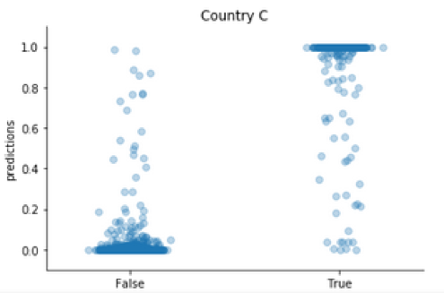
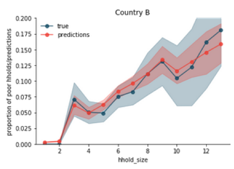
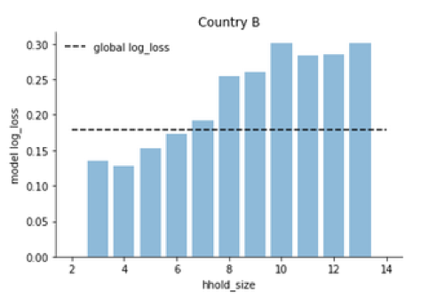
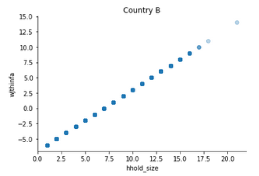

III. Model documentation and write-up
=====================================

1.  Who are you (mini-bio) and what do you do professionally?

 We met in Portugal during our undergrad and Master studies in Applied
 Math.

 RGama: I am a Math teacher at *School of Technology and Management of
 Lamego*, Portugal. Alongside my professional activities I really enjoy
 developing scientific / technological outreach projects, like crystal
 radios construction workshops and VLF signal observations. In the past
years I have also been involved in developing recommendation
 algorithms for e-commerce and tourism.

 hugoguh: I am a Data Scientist at *Rockets of Awesome* in New York
 City. Before I was doing research in Computational Neuroscience
 at the *Kording Lab* in Chicago.

2.  High level summary of your approach: what did you do and why?

 The solution is an ensemble of models built using gradient boosting
 (GB with lightgbm) and neural networks (NN with keras):

A: 5 NN + 4 GB

B: 3 NN + 4 GB

C: 1 NN + 2 GB

In order to reduce the variance of the neural networks we bagged
(Bootstrap aggregating) some models, sampling 8 times, with replacement,
95% of the training set and averaging the predictions across models.

We tried to take into account the only interpretable feature – household
size – when normalizing the features created from the data of the
individual household members.

The most challenging part was feature selection: removing unnecessary
features while adding new features from the data of the individual
household members. We did this using a couple of techniques. A
successful one was to simultaneously fit a model to the core group of
features and to the group of features we wanted to add/test. We then
evaluated the effect that a random permutation on each individual
feature had on the predictions of that model. After going through every
feature, we removed the ones for which we registered a score
improvement.

We used 20-fold cv in Countries A and B in the hope that better
out-of-fold predictions would translate into better fits of the optimal
weight of each model in the ensemble.

3.  Copy and paste the 3 most impactful parts of your code and explain
    what each does and how it helped your model.

 3.1. We tried several approaches for taking into account the household
 size when normalizing the features obtained from the individual
 household members:
 ```python
 ## Add indiv features:  
  if f_dict.get('div_by_hh_size'):  
	        varofint = data_hhold.select_dtypes(['int', 'float']).keys()  
	        data_hh_size = get_hhold_size(data_indiv)  
	        data_hhold = data_hhold.merge(data_hh_size, 
            							  left_index=True, right_index=True)  
	        for v in varofint:  
	            var_name = '%s_div_log_hhold_size' % v  
	            data_hhold[var_name] = \
                		  	   data_hhold[v]/np.log(data_hhold.hhold_size+1)  
	        data_hhold.drop('hhold_size', axis=1, inplace=True)  
 ```
 3.2. For optimizing the parameters of the ensemble, we use SciPy's
 minimize function
```python
from scipy.optimize import minimize    
def fopt(pars, Yt_true, Ym):  
	    Yt_p = np.dot(np.concatenate(Ym, axis=1), np.atleast_2d(pars).T)  
	    return log_loss(Yt_true, Yt_p)  
```
 (where Ym is the out-of-fold prediction for all models). For each fold
 we found the optimal ensemble weights using:
```python
x0 = np.ones((1, n_models))/n_models  
bnds = tuple(n_models*[(0,1)])  
cons = ({'type':'eq', 'fun':lambda x: 1-sum(x)})  
res = minimize(lambda x: fopt(x, Yt_true, Ym_pred), x0, 
			             bounds=bnds, constraints=cons, method='SLSQP', 
                         options={'maxiter':20000, 'disp':False, 'eps':1e-9})  
```
 The final weights of each model in the ensemble are then the average
 across folds.

 3.3. As we said, one of the most challenging aspects of this
 competition was feature selection. We started by fitting a lightgbm
 model on a large set of features. For the first elimination step we
 removed the ones that did not appear on any tree split. Afterwards, we
 refitted the model on the remaining set of features and determine its
 performance via cross-validation. We then used the saved model to
 measure feature importance:
```python
	nr = 5    
	cost_list = []
    model_filename = 'gbm_models/%s_%d_%s_model.txt' % (C, cv_i, prefix)
	sav_model = lgb.Booster(model_file=model_filename)  
	         
	for k, feat in enumerate(feat_list):  
	      new_Xtr = Xtr.copy()  
	      new_Xte = Xte.copy()  
	      if k % 50 ==0:  
	         print(30*'-')  
             msg = 'processing feature number: %d of %d in fold %s' \
              		% (k+1, len(feat_list), cv_i) 
	         print(msg)  
	      cost_fun = 0  
	      for r in range(nr):  
	            new_Xte[feat] = new_Xte[feat].sample(frac=1).values  
	            Yt_pred = sav_model.predict(new_Xte)             
            cost_fun += log_loss(Yt_true, Yt_pred)  
	              
	      cost_list.append(cost_fun/nr)  
```
 After determining the effect that a random permutation on each feature
 had on the score, we removed the ones that improved the score when
 randomized.

4.  What are some other things you tried that didn’t necessarily make it
    into the final workflow (quick overview)?

 We tried dimension reduction with Autoencoders and t-SNE, on the raw
 features and on embeddedings generated by our Neural Network models.
 The models trained on these new features did not improve our ensemble.
 We also tried oversampling with SMOTE and other variations of the
 method (via imbalanced-learn library), but without any success.

 In trying to create features from categorical individual household
 features, one of the unsuccessful attempts was to consider each
 household as a sentence – each value of each household member a word
 in that feature-sentence – and then apply tf-idf.

 Stacking also generally caused overfitting, we don't know if because
 of not enough models or because of the size of the dataset, or because
 buggy code or something else.

5.  Did you use any tools for data preparation or exploratory data
    analysis that aren’t listed in your code submission?

 We used matplotlib for plotting.

6.  How did you evaluate performance of the model other than the
    provided metric, if at all?

 We only used the competition metric. We performed a 20-fold
 cross-validation for countries A and B and 5-fold cross-validation for
 country C.

7.  Anything we should watch out for or be aware of in using your
    model (e.g. code quirks, memory requirements, numerical stability
    issues, etc.)?

 No, except for the variability in the neural network model in
 different runs. This is minimized in the bagged models.

8.  Do you have any useful charts, graphs, or visualizations from the
    process?

Having all the features encoded was an interesting challenge. We did
built visualizations to have a better idea of model performance.



And most of the visualizations were built around the only interpretable
feature: household size. We used it to see how the model was performing
for different household
sizes, 

As well as to look for correlations with other features in the hope of
gaining some intuition on how better to normalize the features we built
from the individual household members data.

Looks like 'wJthinfa' means household size with a linear transformation
in country B:



9.  If you were to continue working on this problem for the next year,
    what methods or techniques might you try in order to build on your
    work so far? Are there other fields or features you felt would have
    been very helpful to have?

 We would have liked to try a NN with permutation invariant layers that
 would treat the household members as a set. This would be in the hope
 of extracting better features, ideally the NN would learn better ways
 of combining the individual household members data, including better
 normalization based on household size. For instance, it would be able
 to recreate some of the features we came up with empirically – e.g.
 the max of hot encoded feature &gt; 0, which translates to "does anyone
 in the household have this value of this feature" – as well with other
 ones we couldn't think of.
